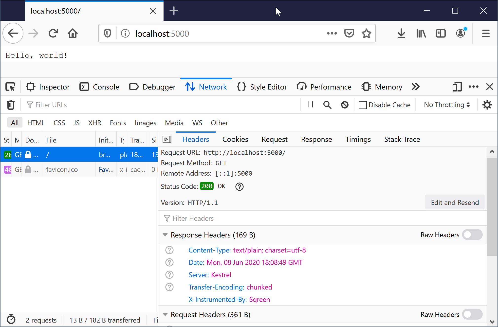

This the implementation of ["How to add a header without changing the code base" home asignment](exercise_net.md). 

*Warning: this will clone and build the [.NET Runtime](https://github.com/dotnet/runtime/), so requires 10 GB of disk-space once build*

Building
========

Currently there only build scripts for Windows. The C# parts will already work under Windows, Linux, macOS & FreeBSD, but the profiler will need build scripts for *nix OSs.

First ensure you have all the [dependencies for Windows](https://github.com/dotnet/runtime/blob/master/docs/workflow/requirements/windows-requirements.md). To ensure all the correct packages from Visual Studio are installed make sure you import [runtime/.vsconfig](runtime/.vsconfig) into the visual studio installer, for more details [how to do this](https://docs.microsoft.com/en-us/visualstudio/install/import-export-installation-configurations?view=vs-2019).

Testing
=======

Hit http://localhost:5000/ in your favourite browser / tool.

Architecture
============

TODO
====

- bash / *nix build scripts
- unit tests for the profiler code
- improve profiler code